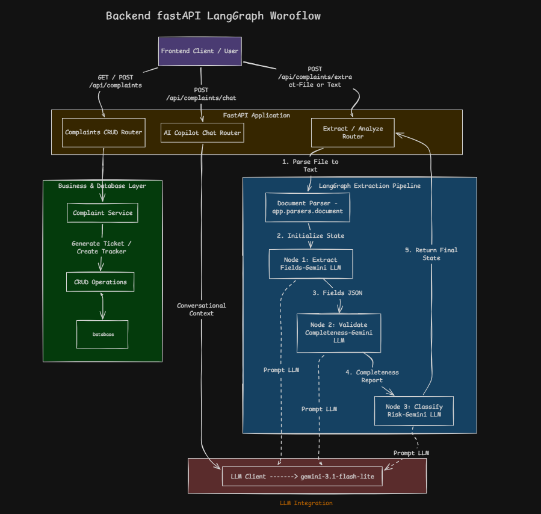
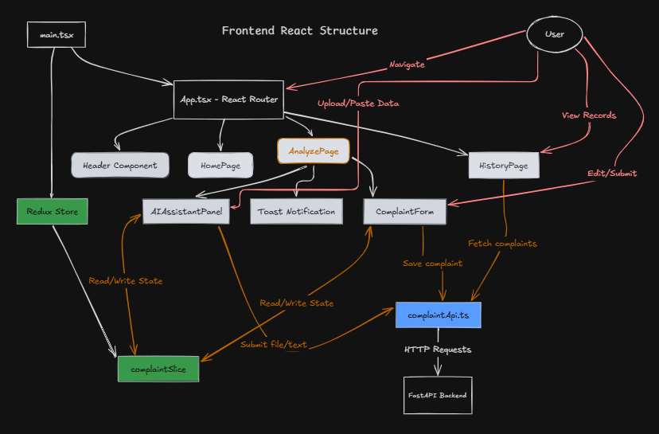

# 🤖 GrievAI

GrievAI is an intelligent, AI-powered assistant designed to streamline customer grievance resolution. It acts as an automated pipeline for receiving, parsing, and resolving customer complaints efficiently. 🚀

## 🎯 What it is

GrievAI is a full-stack web application featuring a modern React frontend and a robust FastAPI backend powered by LangChain/LangGraph. It allows users to submit complaints, attach supporting documents, and interact with an AI Assistant in real-time to analyze and address their concerns efficiently. 💬

## ⚙️ How it works

1. **📥 Submission:** Users can upload documents (like PDFs) or type out their complaints via the interactive chat interface.
2. **🧠 Parsing:** The backend processes these documents using built-in document parsers to extract relevant information.
3. **🛠️ AI Resolution:** An intelligent LangGraph-powered agent analyzes the state of the complaint, accesses relevant tools, and formulates an appropriate response or resolution path.
4. **🤝 Interaction:** The user interacts seamlessly with the AI Assistant through a clean React-based UI.

## 💡 Why we built it

Managing customer complaints manually can be time-consuming, inconsistent, and frustrating for both the customer and support teams. 😩 GrievAI was built to:
- **⚡ Automate** the initial triage and response to complaints.
- **⏱️ Reduce** the time-to-resolution for common issues.
- **🌟 Enhance** the customer experience by providing immediate, context-aware assistance.

## 💻 Tech Stack

### 🔙 Backend
- **🐍 Python**
- **⚡ FastAPI**: High-performance API framework.
- **🦜🔗 LangChain / LangGraph**: Orchestrating the AI agent logic and state.
- **🦄 Uvicorn**: ASGI web server.

### 🎨 Frontend
- **⚛️ React (TSX)**: Modern component-based UI.
- **⚡ Vite & 🥟 Bun**: Fast development and building.
- **🌊 Tailwind CSS**: Utility-first styling.

## 📐 Architecture

Here are the high-level architecture diagrams for both the Backend (FastAPI + LangGraph) and the Frontend (React). 🖼️

### Backend Architecture


### Frontend Architecture


## 🚀 How to Start

To run GrievAI locally, follow these short steps:

### 1️⃣ Start the Backend
Navigate to the `backend` directory, install dependencies, and run the FastAPI server:
```bash
cd GrievAI/backend
# Activate your virtual environment
pip install -r requirements.txt
uvicorn app.main:app --reload
```

### 2️⃣ Start the Frontend
In a new terminal, navigate to the `frontend` directory, install dependencies, and start the development server using Bun:
```bash
cd GrievAI/frontend
bun install
bun dev
```

Your application should now be running! 🎉 The frontend will be accessible via your browser, and it will communicate with the backend API running locally. 🌐
